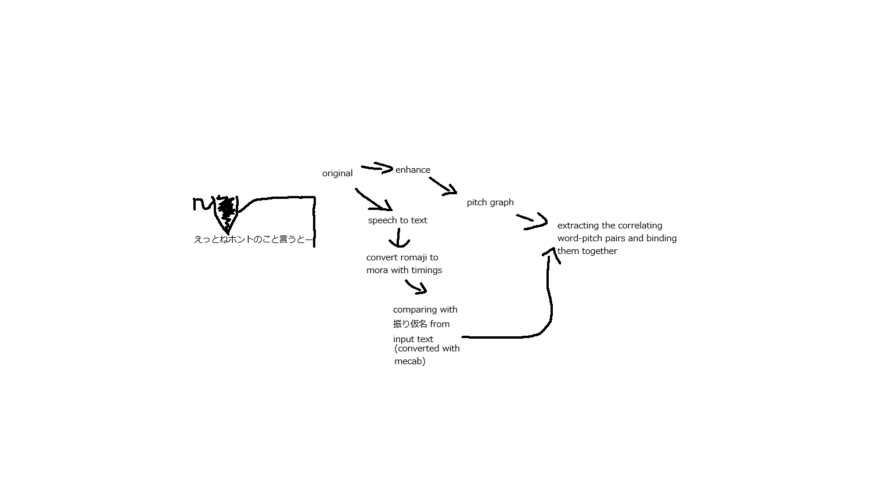

## MPVShadow (work in progress)

Minimal, fast subtitle-audio cutter with pitch visualization and microphone recording for mpv on Windows.

- Press C while a subtitle is visible.
- The analyzer grabs the selected audio track from the playing file via mpv IPC, cuts a small window around the subtitle (±100 ms padding), writes WAV clips to `shadow_out/`, and simultaneously records your microphone.
- A persistent webview window displays:
  - Trimmed subtitle text (parenthetical prefixes removed)
  - Time window, audio track index, and latency
  - RMS/peak analysis and F0 (fundamental frequency) median + voiced percentage
  - Live pitch contour graph (auto-scaled, time-mapped)
  - Play/Pause controls for source audio, mic recording, and synchronized playback

Status: actively evolving; interfaces and behavior may change.

### Current features
- **mpv JSON IPC integration** (named pipe `\\.\\pipe\\MPVShadow`)
- **C key Lua trigger** (`script-message cut_current_sub`) with subtitle presence check
- **External ffmpeg** for:
  - WAV writer (background, non-blocking)
  - Raw PCM analysis pipe (`-f f32le`) for low-latency metrics
  - Microphone capture (DirectShow on Windows)
- **Pitch tracking (F0)** via minimal MPM (NSDF-based) with energy gating and gap bridging
- **Deterministic output naming**: `<basename>_<startms>_<endms>.wav` and `<basename>_<startms>_<endms>_mic.wav`
- **Persistent webview** (wry/tao + WebView2) with pitch graph, playback controls, and mic selector
- **Automatic cleanup**: keeps last 5 unique clips per type (source and mic)



_Diagram shows the planned pipeline with speech enhancement, ASR, and mora alignment (roadmap items)._

### Repo layout
```
MPVShadow/
├─ mpv/
│  └─ scripts/
│     └─ analyzer_launcher.lua    # C key emits script-message to mpv IPC
├─ rust/
│  └─ shadow_analyzer/            # persistent analyzer + UI (Rust + wry)
│     ├─ assets/                  # index.html, style.css, script.js
│     └─ src/
│        ├─ main.rs               # mpv IPC + ffmpeg + UI bridge
│        ├─ pitch.rs              # MPM pitch estimator (NSDF-based)
│        └─ wav.rs                # minimal WAV reader with mono downmix
├─ shadow_out/                    # generated wav clips (auto-created)
└─ README.md
```

### Prerequisites
- Windows 10/11
- ffmpeg on PATH
- mpv
- Rust toolchain (`cargo`)
- Microsoft Edge WebView2 runtime (wry will use it on Windows)

### Setup
1) Enable mpv IPC (named pipe)
   - Add to your mpv config (e.g. `mpv/mpv.conf`):
     - `input-ipc-server=\\.\\pipe\\MPVShadow`
   - Or launch mpv with `--input-ipc-server=\\.\\pipe\\MPVShadow`.

2) Lua keybinding
   - Ensure `mpv/scripts/analyzer_launcher.lua` exists and binds C to:
     - `script-message cut_current_sub` (only when a subtitle is visible).

3) Build the analyzer
```bash
cd rust/shadow_analyzer
cargo build --release
```

### Run
1) Start mpv (with IPC enabled) and play a video with subtitles.
2) Run the analyzer binary:
```bash
rust/shadow_analyzer/target/release/shadow_analyzer.exe
```
3) Press C in mpv when a subtitle is visible.
   - Expected: 
     - OSD confirmation in mpv showing cut window and track info
     - Two WAV files in `shadow_out/`: source clip and mic recording
     - Console output: `first-byte latency: X ms; rms=... peak=...` and `f0: computed in Y ms; src median=... Hz voiced=...%`
     - UI updates with trimmed subtitle text, pitch graph, F0 stats, and Play/Pause controls

### Configuration (current defaults)
- **Padding**: 100 ms before/after subtitle window
- **Output directory**: `shadow_out/` under current working directory
- **Sample format**: 
  - Analysis stream: `f32le -ar 48000 -ac 2` (for RMS/peak)
  - WAV clips: `pcm_s16le -ar 48000 -ac 2` (source), `pcm_s16le -ar 48000 -ac 1` (mic)
  - F0 analysis: decimated to 24 kHz mono
- **Pitch tracking**:
  - Frame: 40 ms, Hop: 10 ms
  - Range: 70–350 Hz (fmin lowered for male voices)
  - NSDF threshold: 0.40 (with RMS-based energy gating at noise_floor × 1.6)
  - Gap bridging: ≤2 unvoiced frames interpolated linearly
  - Voiced% excludes ±100 ms padding edges
- **Microphone**: DirectShow (Windows); falls back to first detected device if none selected
- **Retention**: keeps last 5 unique clips per type; `latest.wav` and `latest_mic.wav` always overwritten

### Troubleshooting
- **No pipe?** Ensure mpv is started with `input-ipc-server=\\.\\pipe\\MPVShadow`.
- **ffmpeg not found?** Confirm `ffmpeg -version` works in a new terminal.
- **UI window doesn't open?** Install the Evergreen WebView2 runtime.
- **Access denied on rebuild (Windows)?** Close the running `shadow_analyzer.exe` before `cargo build`.
- **No microphone detected?** Check DirectShow devices via `ffmpeg -list_devices true -f dshow -i dummy`. Ensure your mic is set as default or select it in the UI dropdown.
- **Pitch graph not visible?** The stroke is white; check if your system theme or display scaling makes it hard to see. Try pressing C on a clearly voiced line.
- **Low voiced percentage on speech?** The energy gate may be too strict for your audio. Current threshold is `noise_floor × 1.6`; this can be adjusted in `src/main.rs`.

### Roadmap
- **Mora alignment**: MeCab + UniDic parsing for per-mora pitch visualization
- **Speech enhancement**: Optional pre-processing with MossFormerGAN-SE to remove background music/noise
- **ASR integration**: Whisper/WhisperX for word-level timestamps and fallback when subtitle text differs from speech
- **Config file**: Padding, output dir, thresholds, model paths
- **CSV log**: Per-cut record with timestamp, path, window, subtitle text, F0 stats
- **Mic F0 computation**: Currently source-only; add parallel F0 for mic clips
- **Optional in-process decode**: Switch from external ffmpeg to native crate when dependencies stabilize

### License
MIT (see `LICENSE` if present). This is a work in progress—APIs and behavior may change.
